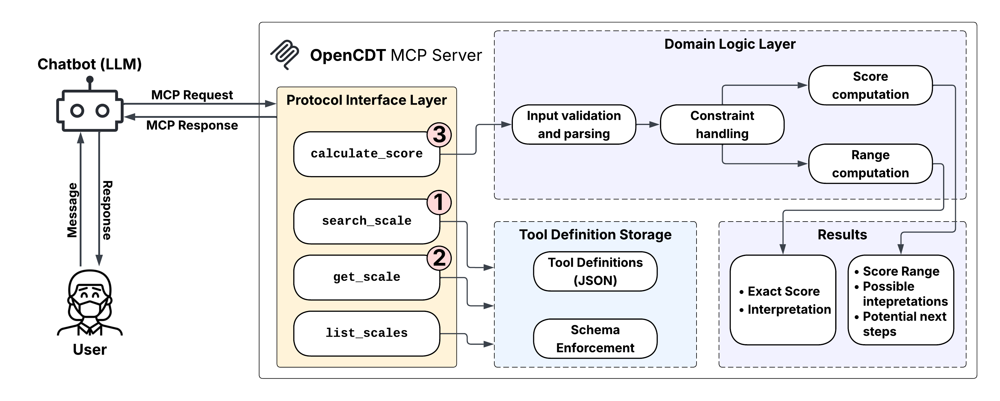

# OpenCDT — Open Clinical Decision Tools

An [MCP](https://modelcontextprotocol.io/) server that gives LLMs access to validated clinical scoring scales. 
It validates inputs, calculates scores, handles partial information, and enforces clinical constraints like 
mutual exclusivity.



## Available Scales

The server ships with multiple scales across multiple specialties.
Adding a new scale is as simple as dropping a JSON file into the `scales/` directory.

## Tools

The server exposes four MCP tools following a standard workflow:

1. **`search_scales`** — Find scales by keyword or tags
2. **`get_scale`** — Retrieve full scale details (items, allowed values, interpretation ranges)
3. **`calculate_score`** — Submit item values and get a score with interpretation
4. **`list_scales`** — Browse all available scales

### Partial Scoring

When not all clinical data is available, `calculate_score` accepts `null` values for unknown items and returns a possible score **range** along with the missing items and their options — so the LLM knows exactly what to ask the patient next.

### Constraint Enforcement

Scales can define mutual exclusivity constraints (e.g., a patient cannot be both "age 65-74" and "age >= 75"). These are enforced during scoring and used to auto-fill dependent items.

## Installation

Requires Python 3.12+.

```bash
git clone https://github.com/aspalinka/OpenCDT.git
cd OpenCDT
uv sync
```

## Usage

Add to your MCP client config:

```json
{
  "mcpServers": {
    "opencdt": {
      "command": "uv",
      "args": ["run", "--project", "/path/to/OpenCDT", "opencdt"]
    }
  }
}
```
